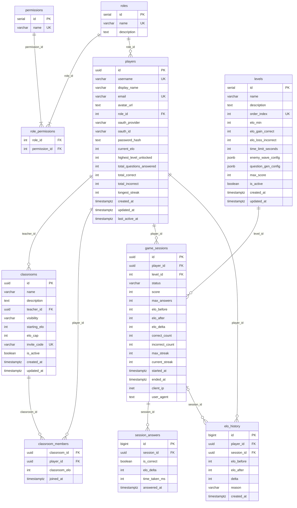

# Magic Nugger App

Educational tower defense game for ages 6–12. Solve math equations to defend against enemies.

**Monorepo:** `web-app` (React + Vite) · `web-server` (Express 5 + PostgreSQL) · `shared` (Zod schemas + types)

---

## Prerequisites

- [Node.js](https://nodejs.org/) 20+
- [npm](https://www.npmjs.com/) 10+
- [Docker](https://www.docker.com/) + [Docker Compose](https://docs.docker.com/compose/)
- PostgreSQL 16 (if not using Docker for DB)

---

## Quick Start

### Option A: Docker for DB, local server + web app (recommended)

Run Postgres in Docker, run the server and web app locally for hot reload.

```bash
# 1. Environment
cp .env.local.example .env.local
# Fill in: GOOGLE_CLIENT_ID, GOOGLE_CLIENT_SECRET, SESSION_SECRET, APP_USER_PASSWORD, POSTGRES_PASSWORD

# 2. Install dependencies
npm install

# 3. Start Postgres
docker compose --env-file=.env.local -f docker-compose.dev.yml up -d magic-nugger-postgres

# 4. Run migrations
npm run db:migrate

# 5. Start web server (terminal 1)
cd web-server && npm run dev

# 6. Start web app (terminal 2)
cd web-app && npm run dev
```

- web-app on `http://localhost:5173`
- web-server on `http://localhost:3000`
- db on `localhost:5432`

To stop:

```bash
docker compose --env-file=.env.local -f docker-compose.dev.yml down
```

---

### Option B: No Docker (everything local)

Requires a local PostgreSQL 16 instance.

```bash
# 1. Environment
cp .env.local.example .env.local
# Set POSTGRES_HOST=localhost and fill in credentials

# 2. Install & migrate
npm install
npm run db:migrate

# 3. Start services
cd web-server && npm run dev
cd web-app && npm run dev
```

---

## Entity Relationship Diagram (2025-05-02)



---

## Project Structure

```

magic-nugger-app/
├── db/
├── docs/
├── nginx/
├── shared/
├── web-app/
├── web-server/
└── .github/workflows/

```

---

## Running Tests

```bash
# Backend tests
npm run test --workspace=web-server

# Frontend tests
npm run test --workspace=web-app

# All tests
npm test
```

---

## Environment Variables

Copy `.env.local.example` to `.env.local` for local dev. See `.env.production.example` for the production shape (written by CI).

| Variable                        | Description                                           |
| ------------------------------- | ----------------------------------------------------- |
| `POSTGRES_USER`                 | Database superuser name                               |
| `POSTGRES_PASSWORD`             | Database superuser password                           |
| `POSTGRES_DB`                   | Database name                                         |
| `POSTGRES_HOST`                 | DB host (`localhost` locally, service name in Docker) |
| `APP_USER`                      | Database app user (SELECT/INSERT/UPDATE/DELETE)       |
| `APP_USER_PASSWORD`             | Database app user password                            |
| `APP_RO_USER`                   | Database read only user (SELECT only)                 |
| `APP_RO_PASSWORD`               | Database read only user password                      |
| `DATABASE_URL`                  | App connection string — set manually for local dev    |
| `SESSION_SECRET`                | Cookie session secret — `openssl rand -base64 32`     |
| `GOOGLE_CLIENT_ID`              | Google OAuth client ID                                |
| `GOOGLE_CLIENT_SECRET`          | Google OAuth client secret                            |
| `CORS_ORIGIN`                   | Frontend origin (default: `http://localhost:5173`)    |
| `PORT`                          | Server port (default: `3000`)                         |
| `RPS_LIMIT`                     | Max requests per second per IP                        |
| `DB_POOL_MAX`                   | Max DB pool connections                               |
| `DB_POOL_IDLE_TIMEOUT_MS`       | DB pool idle timeout                                  |
| `DB_POOL_CONNECTION_TIMEOUT_MS` | DB pool connection timeout                            |
| `DB_QUERY_TIMEOUT_MS`           | DB query timeout                                      |
| `DB_SSL_MODE`                   | DB SSL mode (`prefer`, `require`, or `disable`)       |
| `VITE_WEB_SERVER_URL`           | Web server URL for the frontend                       |
| `VITE_API_URL`                  | API path prefix                                       |

---

## Tech Stack

| Layer    | Tech                                                    |
| -------- | ------------------------------------------------------- |
| Frontend | React 18, Vite, Redux Toolkit, Tailwind CSS, shadcn/ui  |
| Backend  | Express 5,                                              |
| Database | PostgreSQL 16                                           |
| Shared   | Application global types, shared utils                  |
| Auth     | Cookie sessions (no JWT), Google OAuth + local password |
| Tests    | Jest (backend + frontend), jsdom                        |
| Deploy   | Docker Compose on EC2, Nginx reverse proxy              |

---

## License

Skripsi — Jonathan, Alden, Shawn
