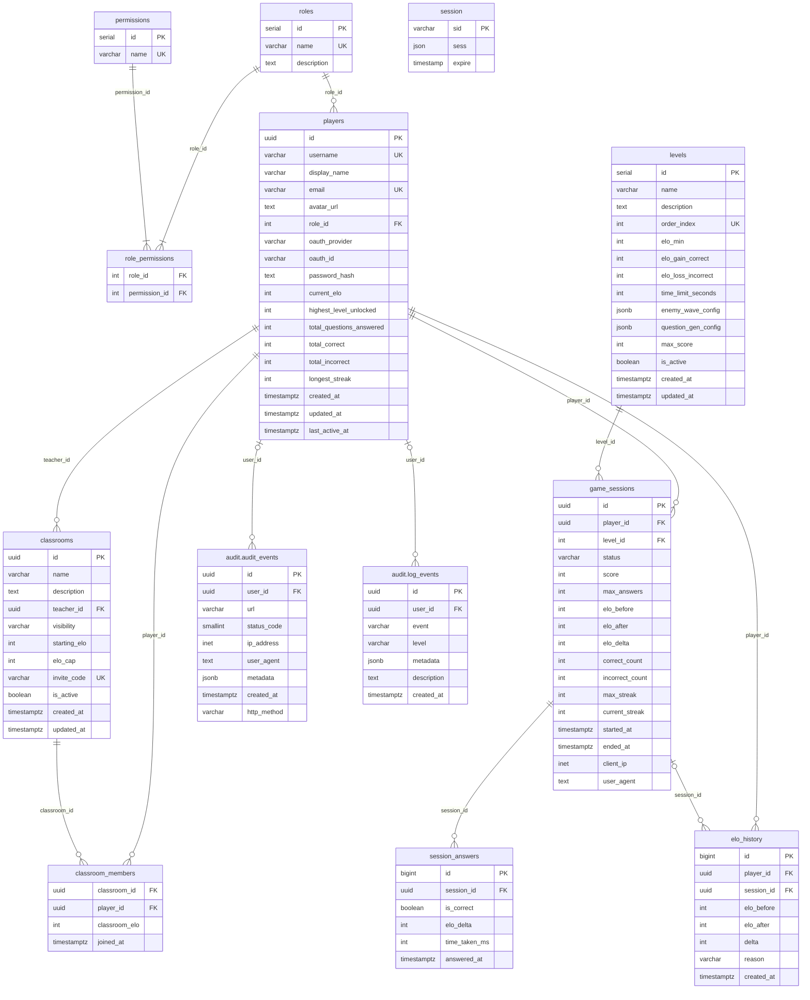

# Magic Nugger App

## Educational tower defense game for ages 6–12. Solve math equations to defend against enemies.

## Game Repo: [Calculon](https://github.com/KRook0110/MagicNagger)

## Release Notes

On new [Unity Build](https://github.com/KRook0110/MagicNagger) update release

```bash
git tag -d <tag>
git push push origin --delete <tag>
gh release create <tag> <src> --title "<title>" --notes "<notes>"
```

## Quick Start

### Option A: Docker for DB, local server + web app (recommended)

Run Postgres in Docker, run the server and web app locally for hot reload.

```bash
# 1. Environment
cp .env.local.example .env.local
# Fill in: GOOGLE_CLIENT_ID, GOOGLE_CLIENT_SECRET, SESSION_SECRET, APP_USER_PASSWORD, POSTGRES_PASSWORD

# 2. Install dependencies
npm install

# 3. Start Postgres + cron
docker compose --env-file=.env.local -f docker-compose.dev.yml up -d magic-nugger-postgres magic-nugger-cron

# 4. Run migrations
npm run db:migrate

# 5. Start web server (terminal 1)
cd web-server && npm run dev

# 6. Start web app (terminal 2)
cd web-app && npm run dev
```

- web-app on `http://localhost:5173`
- web-server on `http://localhost:3000`
- db on `localhost:5432`

To stop:

```bash
docker compose --env-file=.env.local -f docker-compose.dev.yml down
```

---

### Option B: No Docker (everything local)

Requires a local PostgreSQL 16 instance.

```bash
# 1. Environment
cp .env.local.example .env.local
# Set POSTGRES_HOST=localhost and fill in credentials

# 2. Install & migrate
npm install
npm run db:migrate

# 3. Start services
cd web-server && npm run dev
cd web-app && npm run dev
```

---

## Entity Relationship Diagram (2026-05-06)



- `session` managed sessions added 2026-05-06.
- `audit_events` (weekly partitioned, `audit` schema) added 2026-05-06.
- `log_events` (weekly partitioned, `audit` schema) added 2026-05-07. Used by cron jobs and future structured logging.

---

## Project Structure

```

magic-nugger-app/
├── db/
├── docs/
├── nginx/
├── shared/
├── web-app/
├── web-server/
└── .github/workflows/

```

---

## Database Utilities

```bash
# Apply all pending migrations
npm run db:migrate

# Rollback the most recent migration
npm run db:rollback

# Manual backup → db/backups/backup_YYYYMMDD_HHMMSS.sql (requires dev postgres running)
npm run db:backup

# Restore from a dump file
npm run db:restore -- db/backups/backup_20260507_020000.sql
```

Automated weekly backups run via the `magic-nugger-cron` container (Sundays at 02:00). See [`docs/007-cron-jobs.md`](docs/007-cron-jobs.md) for cron job details.

---

## Running Tests

```bash
# Backend tests
npm run test --workspace=web-server

# Frontend tests
npm run test --workspace=web-app

# All tests
npm test
```

---

## Environment Variables

Copy `.env.local.example` to `.env.local` for local dev. See `.env.production.example` for the production shape (written by CI).

Refer to: [DEPLOYMENT.md](https://github.com/christphralden/magic-nugger-app/blob/master/DEPLOYMENT.md)

---

## Tech Stack

| Layer    | Tech                                                    |
| -------- | ------------------------------------------------------- |
| Frontend | React 18, Vite, Redux Toolkit, Tailwind CSS, shadcn/ui  |
| Backend  | Express 5,                                              |
| Database | PostgreSQL 16                                           |
| Shared   | @magic-nugger-app lib                                   |
| Auth     | Cookie sessions (no JWT), Google OAuth + local password |
| Tests    | Jest (backend + frontend), jsdom                        |
| Deploy   | Docker Compose on EC2, Nginx reverse proxy              |

---

## License

Skripsi — Jonathan, Alden, Shawn
