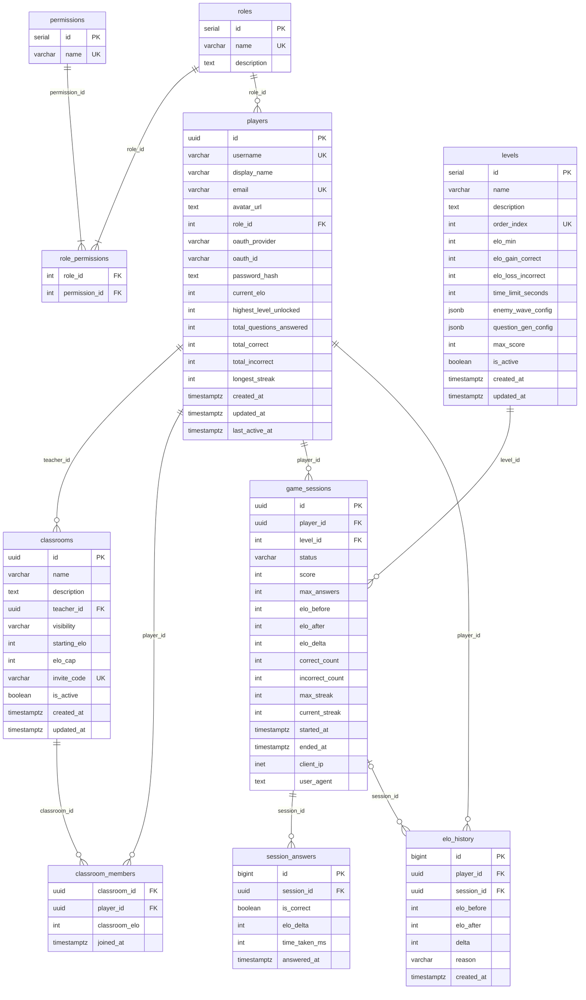

# Entity Relationship Diagram

```mermaid
erDiagram
    permissions {
        serial      id   PK
        varchar     name UK
    }

    roles {
        serial  id          PK
        varchar name        UK
        text    description
    }

    role_permissions {
        int role_id       FK
        int permission_id FK
    }

    players {
        uuid        id                       PK
        varchar     username                 UK
        varchar     display_name
        varchar     email                    UK
        text        avatar_url
        int         role_id                  FK
        varchar     oauth_provider
        varchar     oauth_id
        text        password_hash
        int         current_elo
        int         highest_level_unlocked
        int         total_questions_answered
        int         total_correct
        int         total_incorrect
        int         longest_streak
        timestamptz created_at
        timestamptz updated_at
        timestamptz last_active_at
    }

    levels {
        serial      id                  PK
        varchar     name
        text        description
        int         order_index         UK
        int         elo_min
        int         elo_gain_correct
        int         elo_loss_incorrect
        int         time_limit_seconds
        jsonb       enemy_wave_config
        jsonb       question_gen_config
        int         max_score
        boolean     is_active
        timestamptz created_at
        timestamptz updated_at
    }

    classrooms {
        uuid        id           PK
        varchar     name
        text        description
        uuid        teacher_id   FK
        varchar     visibility
        int         starting_elo
        int         elo_cap
        varchar     invite_code  UK
        boolean     is_active
        timestamptz created_at
        timestamptz updated_at
    }

    classroom_members {
        uuid        classroom_id FK
        uuid        player_id    FK
        int         classroom_elo
        timestamptz joined_at
    }

    game_sessions {
        uuid        id              PK
        uuid        player_id       FK
        int         level_id        FK
        varchar     status
        int         score
        int         max_answers
        int         elo_before
        int         elo_after
        int         elo_delta
        int         correct_count
        int         incorrect_count
        int         max_streak
        int         current_streak
        timestamptz started_at
        timestamptz ended_at
        inet        client_ip
        text        user_agent
    }

    session_answers {
        bigint      id            PK
        uuid        session_id    FK
        boolean     is_correct
        int         elo_delta
        int         time_taken_ms
        timestamptz answered_at
    }

    elo_history {
        bigint      id         PK
        uuid        player_id  FK
        uuid        session_id FK
        int         elo_before
        int         elo_after
        int         delta
        varchar     reason
        timestamptz created_at
    }

    roles            ||--|{ role_permissions  : "role_id"
    permissions      ||--|{ role_permissions  : "permission_id"
    roles            ||--o{ players           : "role_id"
    players          ||--o{ classrooms        : "teacher_id"
    players          ||--o{ classroom_members : "player_id"
    classrooms       ||--o{ classroom_members : "classroom_id"
    players          ||--o{ game_sessions     : "player_id"
    levels           ||--o{ game_sessions     : "level_id"
    game_sessions    ||--o{ session_answers   : "session_id"
    players          ||--o{ elo_history       : "player_id"
    game_sessions    |o--o{ elo_history       : "session_id"
```
