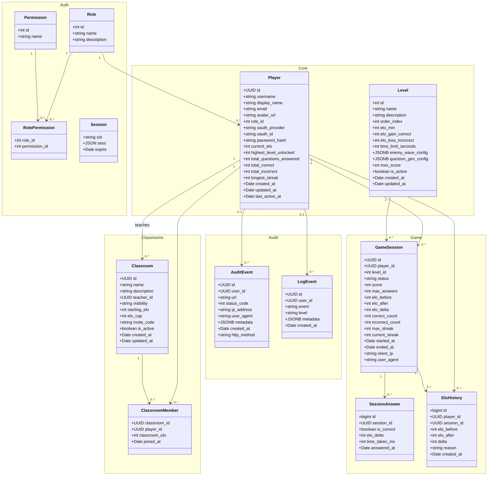
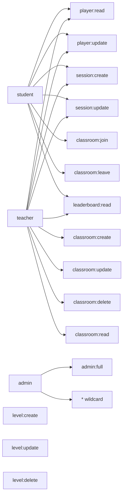

# Domain Class Diagram

```mermaid
classDiagram
    namespace Auth {
        class Role {
            +int    id
            +string name
            +string description
        }
        class Permission {
            +int    id
            +string name
        }
        class RolePermission {
            +int role_id
            +int permission_id
        }
        class Session {
            +string sid
            +JSON   sess
            +Date   expire
        }
    }

    namespace Core {
        class Player {
            +UUID   id
            +string username
            +string display_name
            +string email
            +string avatar_url
            +int    role_id
            +string oauth_provider
            +string oauth_id
            +string password_hash
            +int    current_elo
            +int    highest_level_unlocked
            +int    total_questions_answered
            +int    total_correct
            +int    total_incorrect
            +int    longest_streak
            +Date   created_at
            +Date   updated_at
            +Date   last_active_at
        }
        class Level {
            +int     id
            +string  name
            +string  description
            +int     order_index
            +int     elo_min
            +int     elo_gain_correct
            +int     elo_loss_incorrect
            +int     time_limit_seconds
            +JSONB   enemy_wave_config
            +JSONB   question_gen_config
            +int     max_score
            +boolean is_active
            +Date    created_at
            +Date    updated_at
        }
    }

    namespace Classrooms {
        class Classroom {
            +UUID    id
            +string  name
            +string  description
            +UUID    teacher_id
            +string  visibility
            +int     starting_elo
            +int     elo_cap
            +string  invite_code
            +boolean is_active
            +Date    created_at
            +Date    updated_at
        }
        class ClassroomMember {
            +UUID classroom_id
            +UUID player_id
            +int  classroom_elo
            +Date joined_at
        }
    }

    namespace Game {
        class GameSession {
            +UUID   id
            +UUID   player_id
            +int    level_id
            +string status
            +int    score
            +int    max_answers
            +int    elo_before
            +int    elo_after
            +int    elo_delta
            +int    correct_count
            +int    incorrect_count
            +int    max_streak
            +int    current_streak
            +Date   started_at
            +Date   ended_at
            +string client_ip
            +string user_agent
        }
        class SessionAnswer {
            +bigint  id
            +UUID    session_id
            +boolean is_correct
            +int     elo_delta
            +int     time_taken_ms
            +Date    answered_at
        }
        class EloHistory {
            +bigint id
            +UUID   player_id
            +UUID   session_id
            +int    elo_before
            +int    elo_after
            +int    delta
            +string reason
            +Date   created_at
        }
    }

    namespace Audit {
        class AuditEvent {
            +UUID    id
            +UUID    user_id
            +string  url
            +int     status_code
            +string  ip_address
            +string  user_agent
            +JSONB   metadata
            +Date    created_at
            +string  http_method
        }
        class LogEvent {
            +UUID    id
            +UUID    user_id
            +string  event
            +string  level
            +JSONB   metadata
            +Date    created_at
        }

    }

    Role        "1" --> "0..*" RolePermission
    Permission  "1" --> "0..*" RolePermission
    Role        "1" --> "0..*" Player
    Player      "1" --> "0..*" Classroom      : teaches
    Player      "1" --> "0..*" ClassroomMember
    Classroom   "1" --> "0..*" ClassroomMember
    Player      "1" --> "0..*" GameSession
    Level       "1" --> "0..*" GameSession
    GameSession "1" --> "0..*" SessionAnswer
    Player      "1" --> "0..*" EloHistory
    GameSession "1" --> "0..*" EloHistory
    Player      "0..1" --> "0..*" AuditEvent
    Player      "0..1" --> "0..*" LogEvent
```

---

# RBAC — Role Permission Assignments

```mermaid
graph LR
    S[student]
    T[teacher]
    A[admin]

    PR["player:read"]
    PU["player:update"]
    SC["session:create"]
    SU["session:update"]
    CC["classroom:create"]
    CU["classroom:update"]
    CD["classroom:delete"]
    CR["classroom:read"]
    CJ["classroom:join"]
    CL["classroom:leave"]
    LR["leaderboard:read"]
    LC["level:create"]
    LU["level:update"]
    LD["level:delete"]
    AF["admin:full"]
    WC["* wildcard"]

    S --> PR
    S --> PU
    S --> SC
    S --> SU
    S --> CJ
    S --> CL
    S --> LR

    T --> PR
    T --> PU
    T --> SC
    T --> SU
    T --> CC
    T --> CU
    T --> CD
    T --> CR
    T --> LR

    A --> AF
    A --> WC
```
