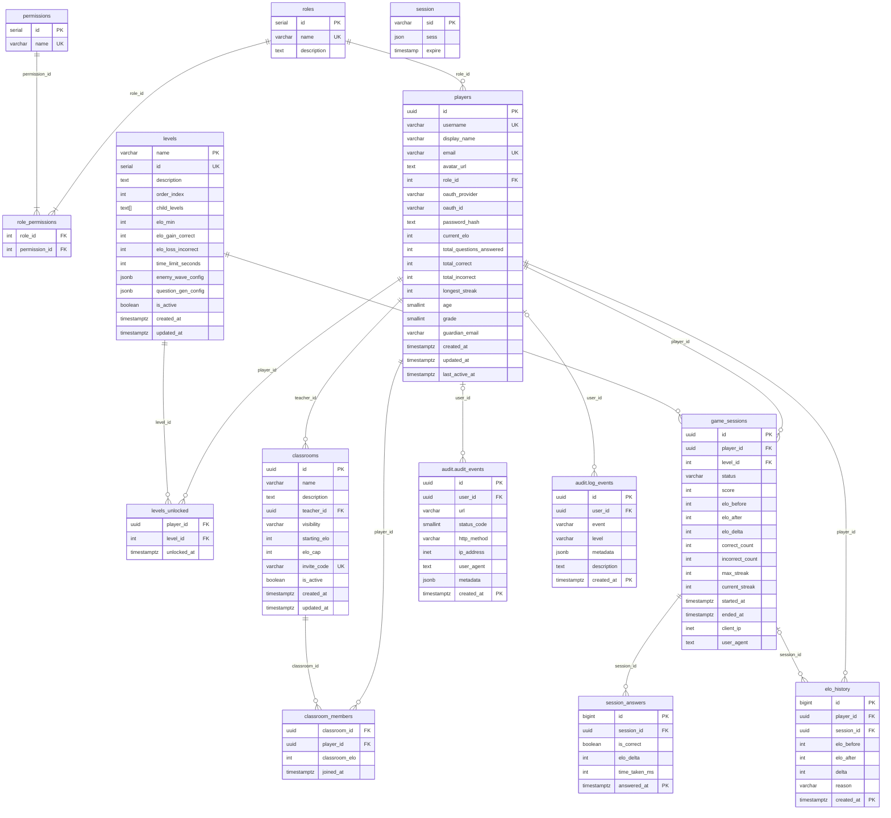

# Entity Relationship Diagram

> Generated from migrations. Supersedes 20260507_erd.md.
>
> **Changes from previous ERD:**
> - `levels`: PK corrected to `name`; `child_levels` added; `max_score` removed; `order_index` not unique
> - `players`: `age`, `grade`, `guardian_email` added; `highest_level_unlocked` removed (never existed)
> - `game_sessions`: `max_answers` removed
> - `elo_history`: `session_abandoned` added to reason enum
> - `levels_unlocked`: new table
> - Partitioned tables annotated

