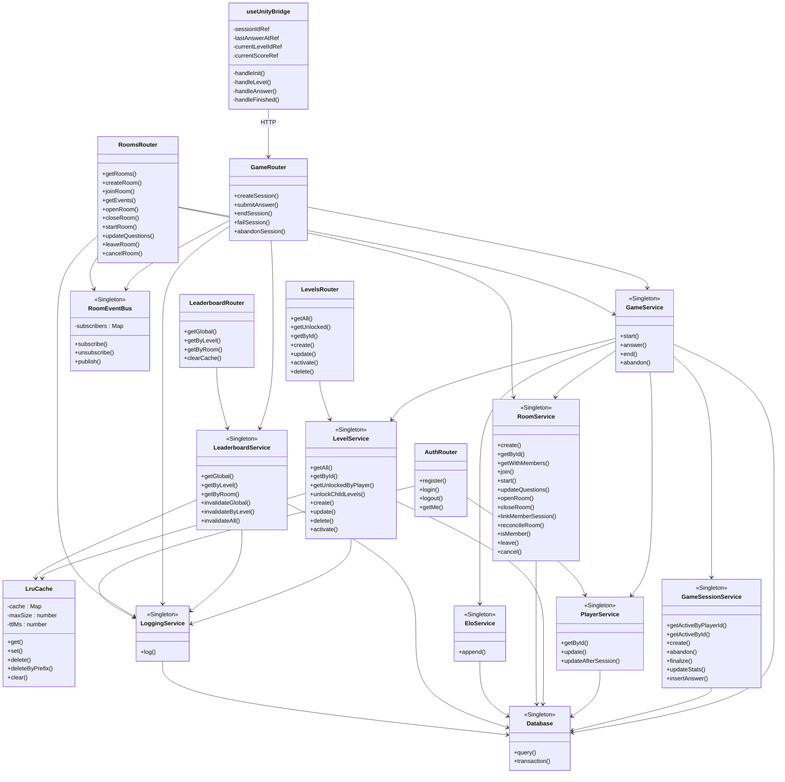

```mermaid
classDiagram
    %% Infrastructure
    class Database {
        <<Singleton>>
        +query()
        +transaction()
    }

    class LruCache {
        -cache : Map
        -maxSize : number
        -ttlMs : number
        +get()
        +set()
        +delete()
        +deleteByPrefix()
        +clear()
    }

    %% Services
    class GameService {
        <<Singleton>>
        +start()
        +answer()
        +end()
        +abandon()
    }

    class GameSessionService {
        <<Singleton>>
        +getActiveByPlayerId()
        +getActiveById()
        +create()
        +abandon()
        +finalize()
        +updateStats()
        +insertAnswer()
    }

    class PlayerService {
        <<Singleton>>
        +getById()
        +update()
        +updateAfterSession()
    }

    class LevelService {
        <<Singleton>>
        +getAll()
        +getById()
        +getUnlockedByPlayer()
        +unlockChildLevels()
        +create()
        +update()
        +delete()
        +activate()
    }

    class RoomService {
        <<Singleton>>
        +create()
        +getById()
        +getWithMembers()
        +join()
        +start()
        +updateQuestions()
        +openRoom()
        +closeRoom()
        +linkMemberSession()
        +reconcileRoom()
        +isMember()
        +leave()
        +cancel()
    }

    class EloService {
        <<Singleton>>
        +append()
    }

    class LeaderboardService {
        <<Singleton>>
        +getGlobal()
        +getByLevel()
        +getByRoom()
        +invalidateGlobal()
        +invalidateByLevel()
        +invalidateAll()
    }

    class LoggingService {
        <<Singleton>>
        +log()
    }

    class RoomEventBus {
        <<Singleton>>
        -subscribers : Map
        +subscribe()
        +unsubscribe()
        +publish()
    }

    %% Routers (Controllers)
    class AuthRouter {
        +register()
        +login()
        +logout()
        +getMe()
    }

    class GameRouter {
        +createSession()
        +submitAnswer()
        +endSession()
        +failSession()
        +abandonSession()
    }

    class LevelsRouter {
        +getAll()
        +getUnlocked()
        +getById()
        +create()
        +update()
        +activate()
        +delete()
    }

    class RoomsRouter {
        +getRooms()
        +createRoom()
        +joinRoom()
        +getEvents()
        +openRoom()
        +closeRoom()
        +startRoom()
        +updateQuestions()
        +leaveRoom()
        +cancelRoom()
    }

    class LeaderboardRouter {
        +getGlobal()
        +getByLevel()
        +getByRoom()
        +clearCache()
    }

    %% React Client Bridge (client-side)
    class useUnityBridge {
        -sessionIdRef
        -lastAnswerAtRef
        -currentLevelIdRef
        -currentScoreRef
        -handleInit()
        -handleLevel()
        -handleAnswer()
        -handleFinished()
    }

    %% Service → Service
    GameService --> GameSessionService
    GameService --> LevelService
    GameService --> PlayerService
    GameService --> EloService
    GameService --> RoomService
    LevelService --> LruCache
    LevelService --> LoggingService
    LeaderboardService --> LruCache
    LeaderboardService --> LoggingService

    %% Services → Database
    GameService --> Database
    GameSessionService --> Database
    PlayerService --> Database
    LevelService --> Database
    RoomService --> Database
    EloService --> Database
    LeaderboardService --> Database
    LoggingService --> Database

    %% Router → Service
    GameRouter --> GameService
    GameRouter --> LeaderboardService
    GameRouter --> RoomEventBus
    GameRouter --> LoggingService
    RoomsRouter --> RoomService
    RoomsRouter --> GameService
    RoomsRouter --> RoomEventBus
    RoomsRouter --> LoggingService
    AuthRouter --> PlayerService
    AuthRouter --> LoggingService
    LevelsRouter --> LevelService
    LeaderboardRouter --> LeaderboardService

    %% React bridge → API (cross-boundary)
    useUnityBridge --> GameRouter : HTTP
```
