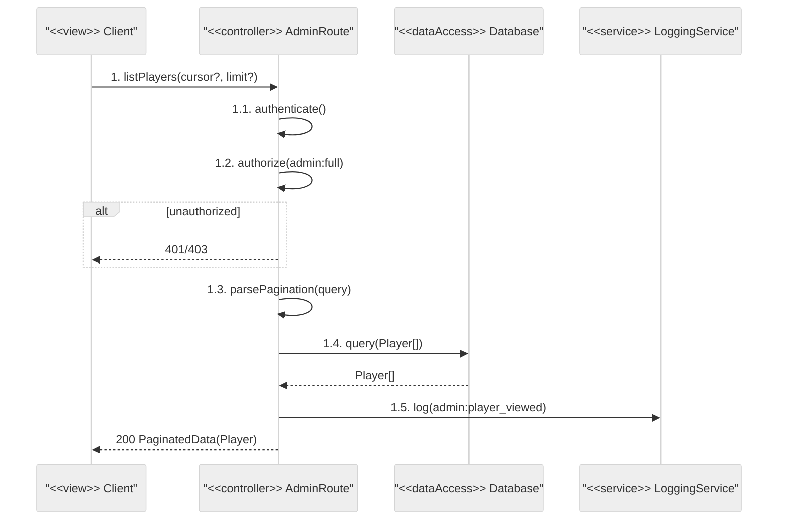
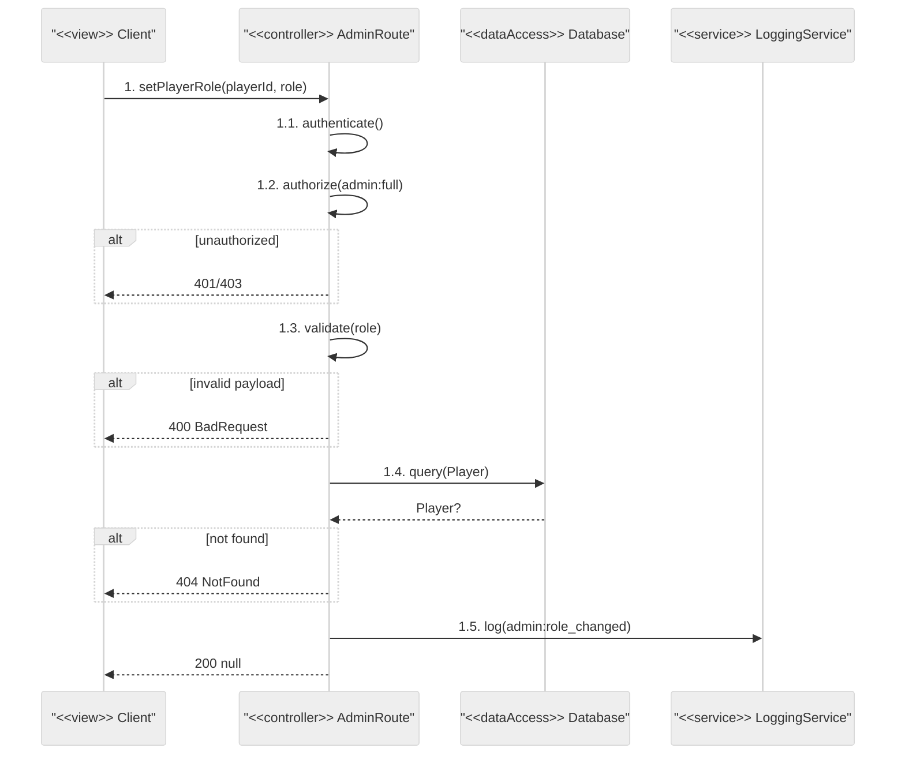
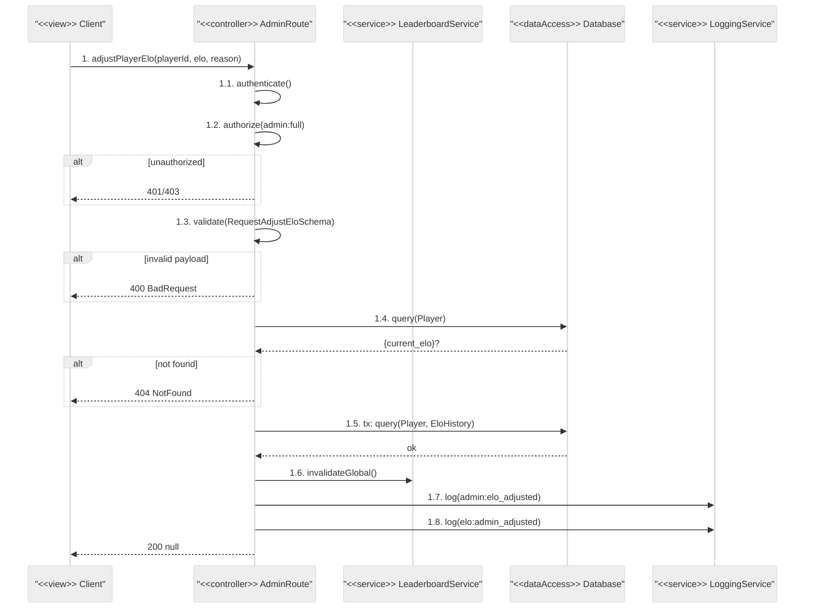
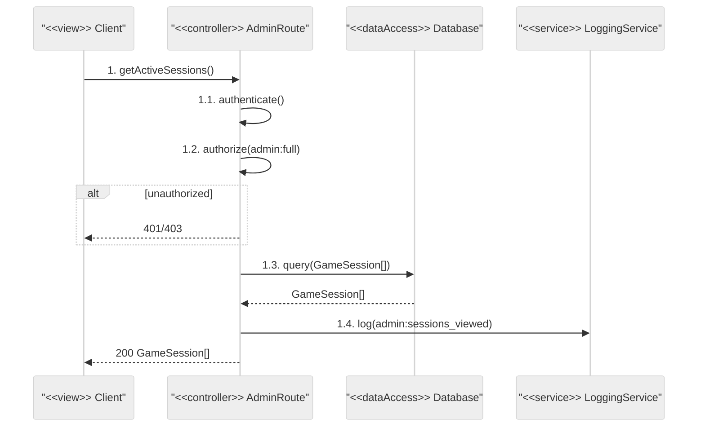
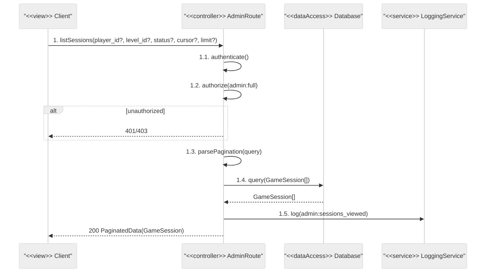
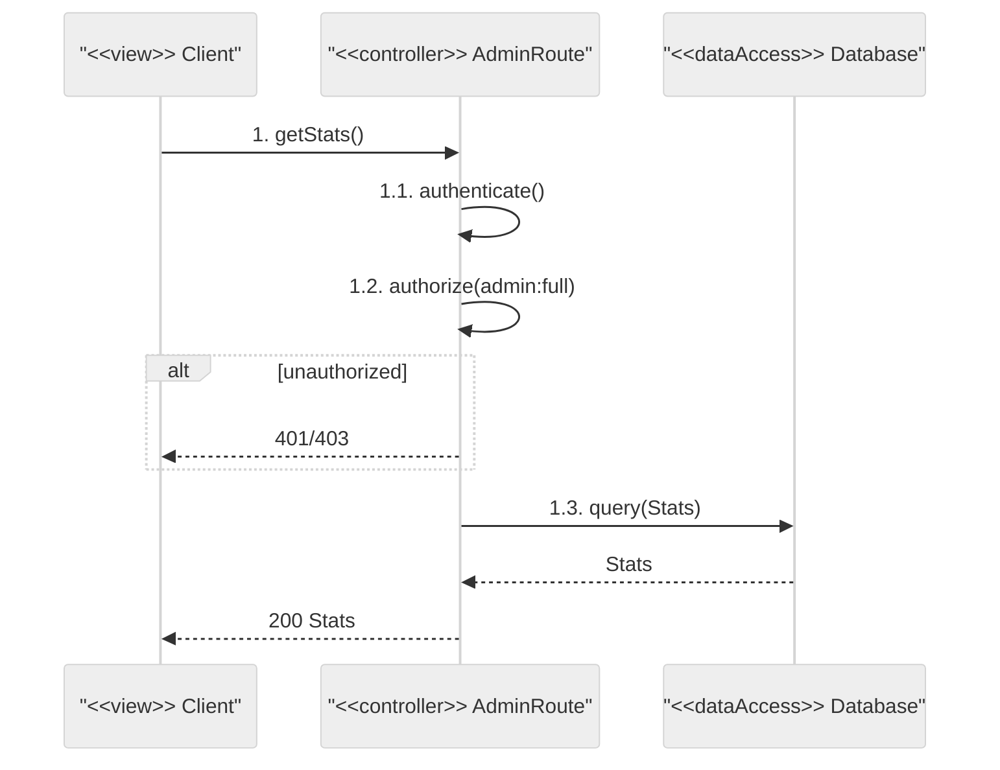

# Admin Route — Sequence Diagrams

All endpoints require: `authenticate` + `authorize("admin:full")`

## Endpoints
- `GET /players`
- `PATCH /players/:id/role`
- `PATCH /players/:id/elo`
- `GET /game-sessions/active`
- `GET /game-sessions`
- `GET /stats`

---

## GET /players

## PATCH /players/:id/role

## PATCH /players/:id/elo

## GET /game-sessions/active

## GET /game-sessions

## GET /stats

