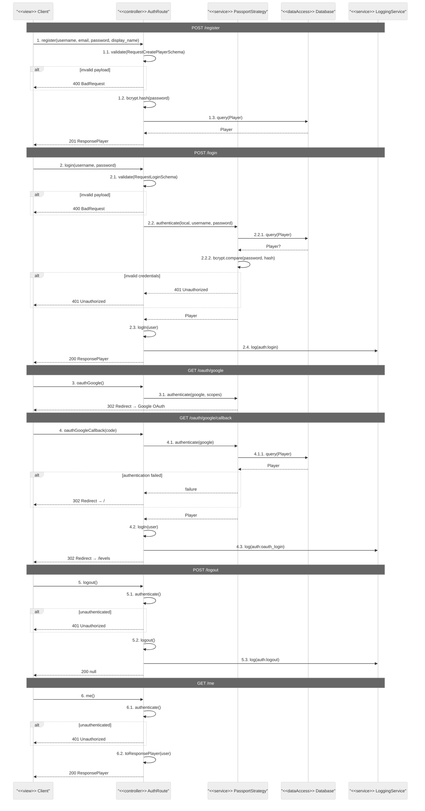

# Auth Route — Sequence Diagrams

## Endpoints
- `POST /register`
- `POST /login`
- `GET /oauth/google`
- `GET /oauth/google/callback`
- `POST /logout`
- `GET /me`

```mermaid
%%{init: {'theme': 'neutral'}}%%
sequenceDiagram
    participant C as "<<view>> Client"
    participant R as "<<controller>> AuthRoute"
    participant PASS as "<<service>> PassportStrategy"
    participant DB as "<<dataAccess>> Database"
    participant LOG as "<<service>> LoggingService"

    Note over C,LOG: POST /register
    C->>R: 1. register(username, email, password, display_name)
    R->>R: 1.1. validate(RequestCreatePlayerSchema)
    alt invalid payload
        R-->>C: 400 BadRequest
    end
    R->>R: 1.2. bcrypt.hash(password)
    R->>DB: 1.3. query(Player)
    DB-->>R: Player
    R-->>C: 201 ResponsePlayer

    Note over C,LOG: POST /login
    C->>R: 2. login(username, password)
    R->>R: 2.1. validate(RequestLoginSchema)
    alt invalid payload
        R-->>C: 400 BadRequest
    end
    R->>PASS: 2.2. authenticate(local, username, password)
    PASS->>DB: 2.2.1. query(Player)
    DB-->>PASS: Player?
    PASS->>PASS: 2.2.2. bcrypt.compare(password, hash)
    alt invalid credentials
        PASS-->>R: 401 Unauthorized
        R-->>C: 401 Unauthorized
    end
    PASS-->>R: Player
    R->>R: 2.3. logIn(user)
    R->>LOG: 2.4. log(auth:login)
    R-->>C: 200 ResponsePlayer

    Note over C,LOG: GET /oauth/google
    C->>R: 3. oauthGoogle()
    R->>PASS: 3.1. authenticate(google, scopes)
    PASS-->>C: 302 Redirect → Google OAuth

    Note over C,LOG: GET /oauth/google/callback
    C->>R: 4. oauthGoogleCallback(code)
    R->>PASS: 4.1. authenticate(google)
    PASS->>DB: 4.1.1. query(Player)
    DB-->>PASS: Player
    alt authentication failed
        PASS-->>R: failure
        R-->>C: 302 Redirect → /
    end
    PASS-->>R: Player
    R->>R: 4.2. logIn(user)
    R->>LOG: 4.3. log(auth:oauth_login)
    R-->>C: 302 Redirect → /levels

    Note over C,LOG: POST /logout
    C->>R: 5. logout()
    R->>R: 5.1. authenticate()
    alt unauthenticated
        R-->>C: 401 Unauthorized
    end
    R->>R: 5.2. logout()
    R->>LOG: 5.3. log(auth:logout)
    R-->>C: 200 null

    Note over C,LOG: GET /me
    C->>R: 6. me()
    R->>R: 6.1. authenticate()
    alt unauthenticated
        R-->>C: 401 Unauthorized
    end
    R->>R: 6.2. toResponsePlayer(user)
    R-->>C: 200 ResponsePlayer
```
