# Classrooms Route — Sequence Diagrams

All endpoints require `authenticate`. Specific endpoints additionally require `authorize(permission)`.

## Endpoints
- `POST /` — create classroom
- `GET /` — list classrooms
- `GET /:id` — get classroom
- `PATCH /:id` — update classroom
- `DELETE /:id` — delete classroom
- `POST /join` — join by invite code
- `DELETE /:id/leave` — leave classroom

```mermaid
%%{init: {'theme': 'neutral'}}%%
sequenceDiagram
    participant C as "<<view>> Client"
    participant R as "<<controller>> ClassroomsRoute"
    participant CS as "<<service>> ClassroomService"
    participant DB as "<<dataAccess>> Database"

    Note over C,DB: POST / — Create Classroom
    C->>R: 1. createClassroom(name, description, visibility, starting_elo, elo_cap)
    R->>R: 1.1. authenticate()
    R->>R: 1.2. authorize(classroom:create)
    alt unauthorized
        R-->>C: 401/403
    end
    R->>R: 1.3. validate(RequestCreateClassroomSchema)
    alt invalid payload
        R-->>C: 400 BadRequest
    end
    R->>CS: 1.4. create(teacherId, body)
    CS->>CS: 1.4.1. generateInviteCode()
    CS->>DB: 1.4.2. query(Classroom)
    DB-->>CS: Classroom
    CS-->>R: Classroom
    R-->>C: 201 Classroom

    Note over C,DB: GET / — List Classrooms
    C->>R: 2. listClassrooms()
    R->>R: 2.1. authenticate()
    alt unauthenticated
        R-->>C: 401 Unauthorized
    end
    R-->>C: 200 []

    Note over C,DB: GET /:id — Get Classroom
    C->>R: 3. getClassroom(classroomId)
    R->>R: 3.1. authenticate()
    alt unauthenticated
        R-->>C: 401 Unauthorized
    end
    R->>CS: 3.2. getById(classroomId)
    CS->>DB: 3.2.1. query(Classroom)
    DB-->>CS: Classroom?
    alt not found
        CS-->>R: 404 NotFound
        R-->>C: 404 NotFound
    end
    CS-->>R: Classroom
    R-->>C: 200 Classroom

    Note over C,DB: PATCH /:id — Update Classroom
    C->>R: 4. updateClassroom(classroomId, name?, description?, visibility?, starting_elo?, elo_cap?)
    R->>R: 4.1. authenticate()
    R->>R: 4.2. authorize(classroom:update)
    alt unauthorized
        R-->>C: 401/403
    end
    R->>R: 4.3. validate(RequestUpdateClassroomSchema)
    alt invalid payload
        R-->>C: 400 BadRequest
    end
    R->>DB: 4.4. query(Classroom)
    DB-->>R: {teacher_id}?
    alt teacher_id != user.id
        R-->>C: 403 Forbidden
    end
    R->>CS: 4.5. update(classroomId, body)
    CS->>DB: 4.5.1. query(Classroom)
    DB-->>CS: Classroom?
    alt not found
        CS-->>R: 404 NotFound
        R-->>C: 404 NotFound
    end
    CS-->>R: Classroom
    R-->>C: 200 Classroom

    Note over C,DB: DELETE /:id — Delete Classroom
    C->>R: 5. deleteClassroom(classroomId)
    R->>R: 5.1. authenticate()
    R->>R: 5.2. authorize(classroom:delete)
    alt unauthorized
        R-->>C: 401/403
    end
    R->>DB: 5.3. query(Classroom)
    DB-->>R: {teacher_id}?
    alt teacher_id != user.id
        R-->>C: 403 Forbidden
    end
    R->>CS: 5.4. delete(classroomId)
    CS->>DB: 5.4.1. query(Classroom)
    DB-->>CS: rowCount
    alt not found
        CS-->>R: 404 NotFound
        R-->>C: 404 NotFound
    end
    R-->>C: 200 null

    Note over C,DB: POST /join — Join Classroom
    C->>R: 6. joinClassroom(invite_code)
    R->>R: 6.1. authenticate()
    R->>R: 6.2. authorize(classroom:join)
    alt unauthorized
        R-->>C: 401/403
    end
    R->>R: 6.3. validate(RequestJoinClassroomSchema)
    alt invalid payload
        R-->>C: 400 BadRequest
    end
    R->>CS: 6.4. join(playerId, invite_code)
    CS->>DB: 6.4.1. query(Classroom)
    DB-->>CS: {id, starting_elo}?
    alt invalid invite code
        CS-->>R: 404 NotFound
        R-->>C: 404 NotFound
    end
    CS->>DB: 6.4.2. query(ClassroomMember)
    DB-->>CS: ok
    R-->>C: 200 null

    Note over C,DB: DELETE /:id/leave — Leave Classroom
    C->>R: 7. leaveClassroom(classroomId)
    R->>R: 7.1. authenticate()
    R->>R: 7.2. authorize(classroom:leave)
    alt unauthorized
        R-->>C: 401/403
    end
    R->>CS: 7.3. leave(playerId, classroomId)
    CS->>DB: 7.3.1. query(ClassroomMember)
    DB-->>CS: ok
    R-->>C: 200 null
```

