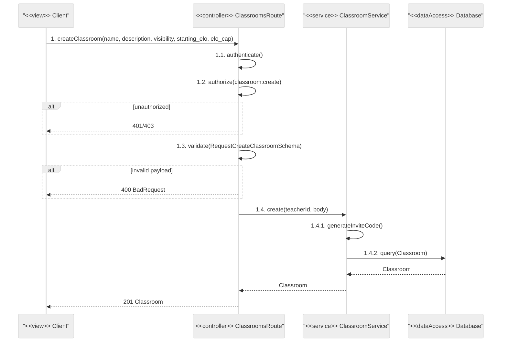
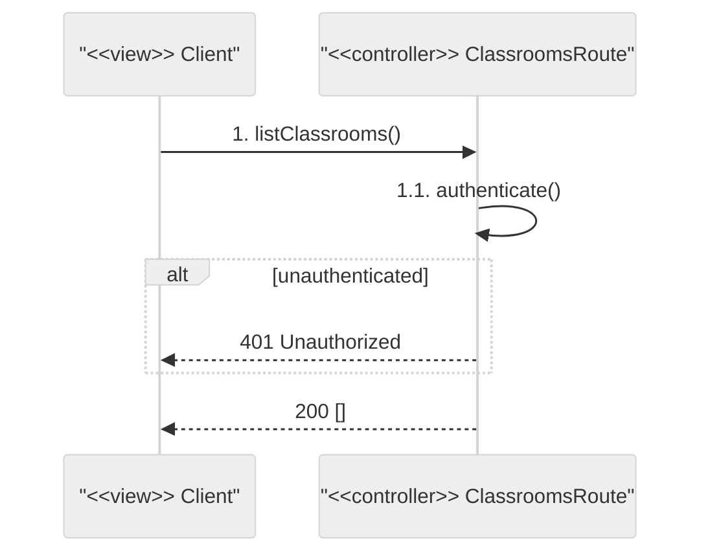
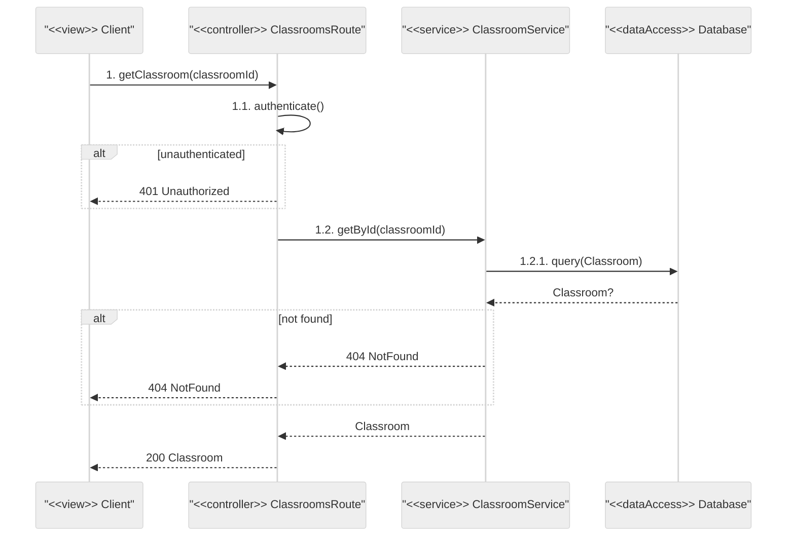
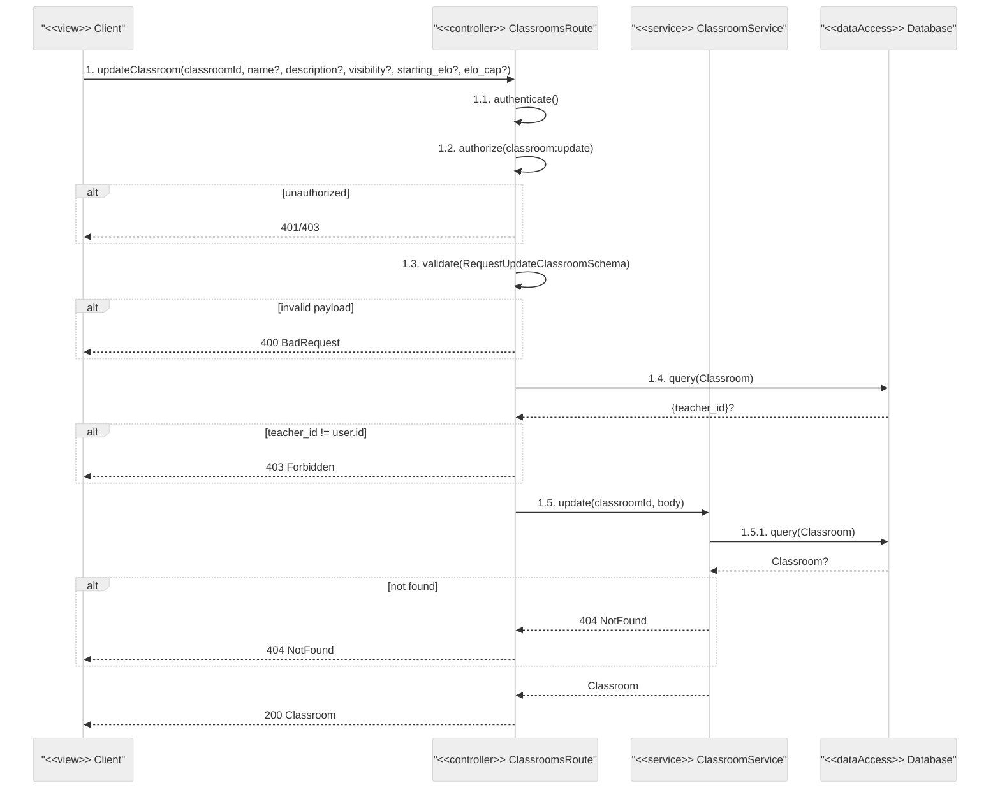
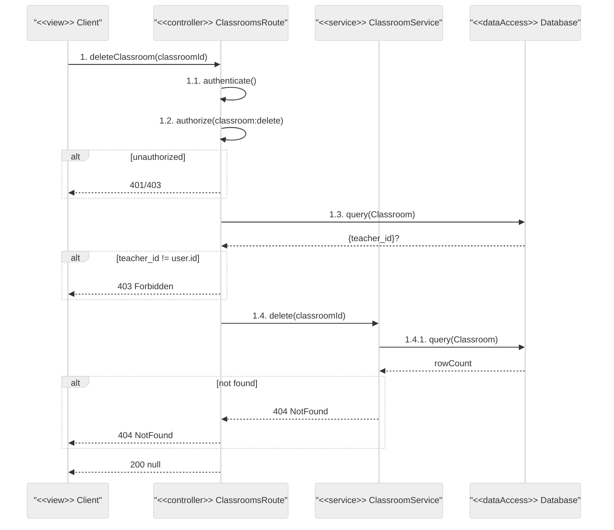
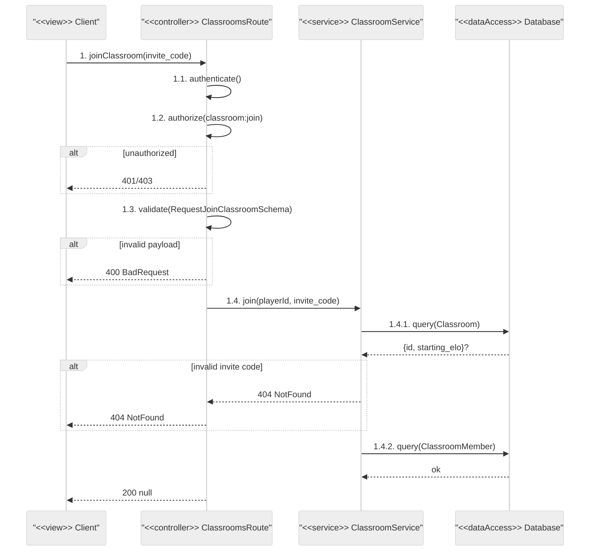
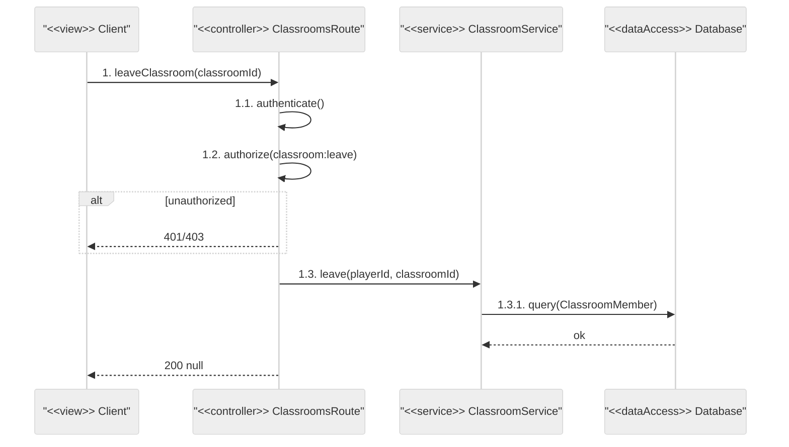

# Classrooms Route — Sequence Diagrams

## Endpoints
- `POST /` — create classroom
- `GET /` — list classrooms
- `GET /:id` — get classroom
- `PATCH /:id` — update classroom
- `DELETE /:id` — delete classroom
- `POST /join` — join by invite code
- `DELETE /:id/leave` — leave classroom

---

## POST /

## GET /

## GET /:id

## PATCH /:id

## DELETE /:id

## POST /join

## DELETE /:id/leave

