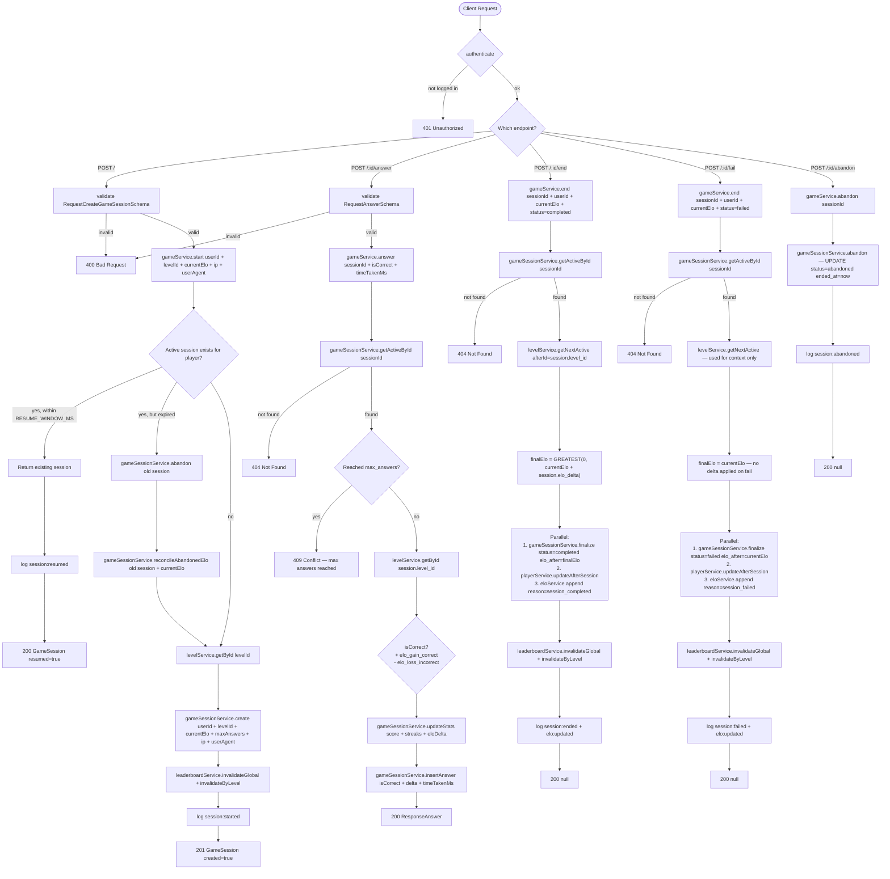

# Game Route — Flowchart

All endpoints require `authenticate`. No additional permission required.

## Endpoints
- `POST /` — start or resume game session
- `POST /:id/answer` — submit answer
- `POST /:id/end` — complete session (success)
- `POST /:id/fail` — fail session
- `POST /:id/abandon` — abandon session

