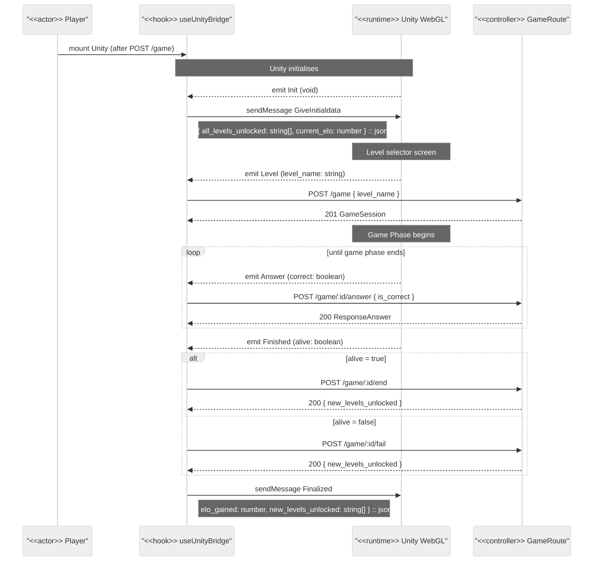

# Unity ↔ Frontend Communication

Implemented via `use-unity-bridge.ts`. All Unity→FE communication uses browser custom events (`addEventListener`). All FE→Unity communication uses `sendMessage("ReactUnityCommunication", method, jsonPayload)`.

## Session Lifecycle

## Event Contract

| Direction    | Name              | Payload                                                        | When                        |
|--------------|-------------------|----------------------------------------------------------------|-----------------------------|
| Unity → FE   | `Init`            | void                                                           | Unity loaded and ready      |
| FE → Unity   | `GiveInitialdata` | `{ all_levels_unlocked: string[], current_elo: number }`       | On Init event               |
| Unity → FE   | `Level`           | `level_name: string`                                           | Player selects a level      |
| FE → API     | `POST /game`      | `{ level_name }`                                               | On Level event              |
| Unity → FE   | `Answer`          | `correct: boolean`                                             | Player submits an answer    |
| FE → API     | `POST /game/:id/answer` | `{ is_correct }`                                         | On Answer event             |
| Unity → FE   | `Finished`        | `alive: boolean`                                              | Game phase ends             |
| FE → API     | `POST /game/:id/end` or `/fail` | —                                                | alive true / false          |
| FE → Unity   | `Finalized`       | `{ elo_gained: number, new_levels_unlocked: string[] }`        | After session end or fail   |

> **Game Object**: All `sendMessage` calls target `"ReactUnityCommunication"`.  
> **Note**: `GiveInitialdata` is spelled with a lowercase `d` — matches the Unity C# method name exactly.
