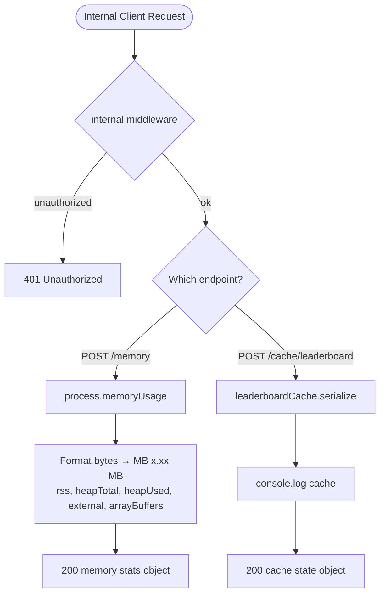

# Internal Route — Flowchart

All endpoints require `internal` middleware (not exposed to public clients).

## Endpoints
- `POST /memory` — server memory usage
- `POST /cache/leaderboard` — leaderboard cache state

