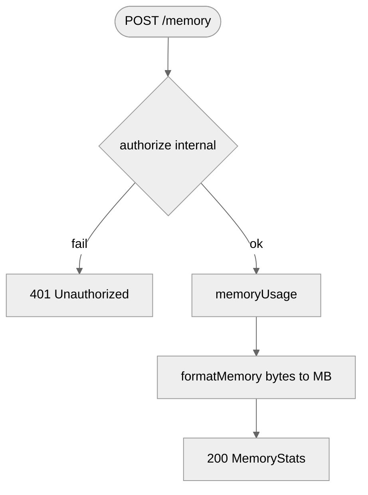
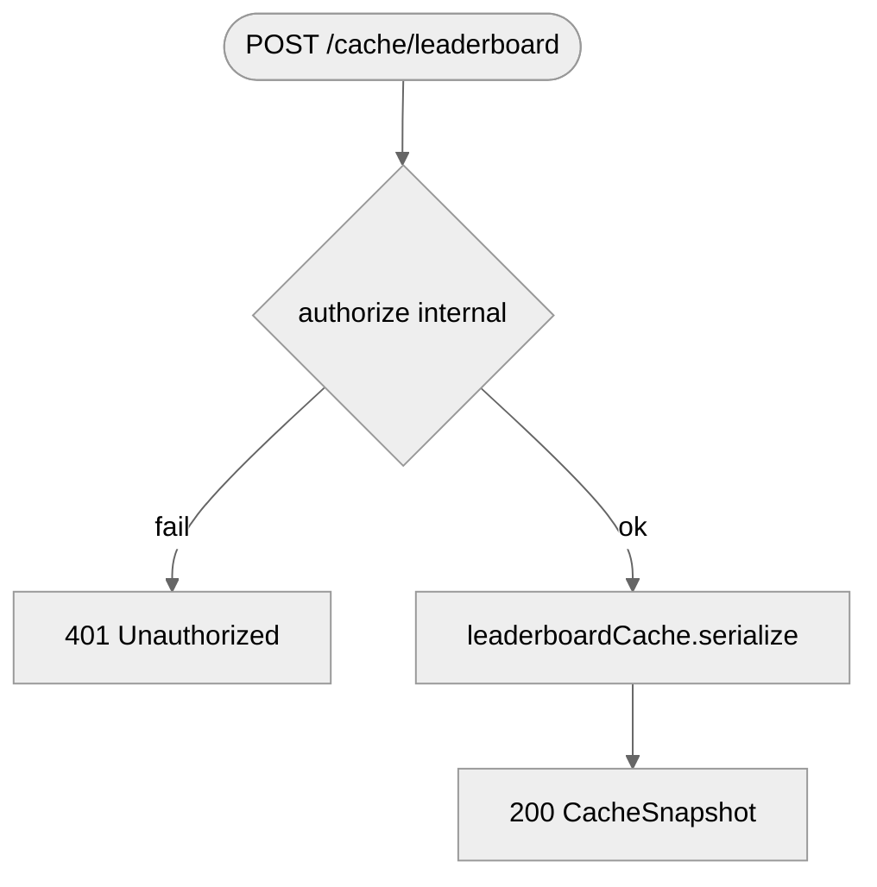

# Internal Route — Flowchart

## Endpoints
- `POST /memory` — server memory usage
- `POST /cache/leaderboard` — leaderboard cache state

---

## POST /memory

```mermaid
%%{init: {'theme': 'neutral'}}%%
flowchart TD
    START([POST /memory]) --> AUTH{authorize internal}
    AUTH -->|fail| E401[401 Unauthorized]
    AUTH -->|ok| MEM[memoryUsage]
    MEM --> FMT[formatMemory bytes to MB]
    FMT --> R200[200 MemoryStats]
```

## POST /cache/leaderboard

```mermaid
%%{init: {'theme': 'neutral'}}%%
flowchart TD
    START([POST /cache/leaderboard]) --> AUTH{authorize internal}
    AUTH -->|fail| E401[401 Unauthorized]
    AUTH -->|ok| CACHE[leaderboardCache.serialize]
    CACHE --> R200[200 CacheSnapshot]
```
