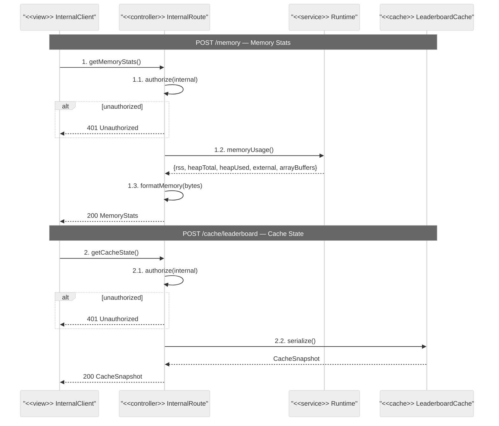

# Internal Route — Sequence Diagrams

## Endpoints
- `POST /memory` — server memory usage
- `POST /cache/leaderboard` — leaderboard cache state

## Notes

- The `internal` middleware restricts access to trusted internal callers only (e.g., health check systems, observability tooling).
- These endpoints are diagnostic — they expose server internals and must never be accessible from public internet.
