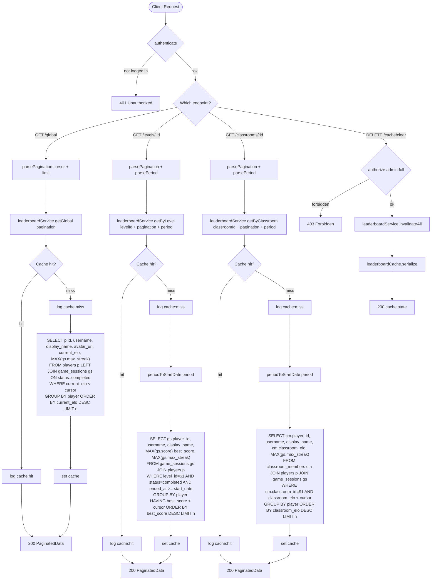

# Leaderboard Route — Flowchart

All endpoints require `authenticate`. Cache clear requires `authorize("admin:full")`.

## Endpoints
- `GET /global` — global leaderboard
- `GET /levels/:id` — level leaderboard
- `GET /classrooms/:id` — classroom leaderboard
- `DELETE /cache/clear` — clear all cache (admin)

