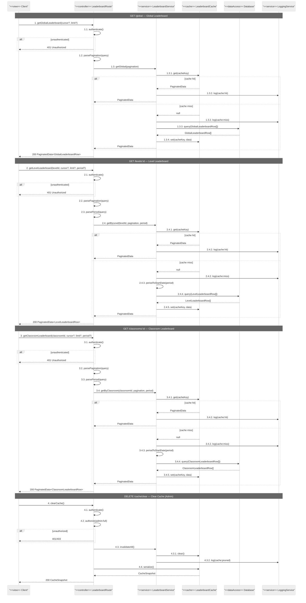

# Leaderboard Route — Sequence Diagrams

All endpoints require `authenticate`. Cache clear requires `authorize("admin:full")`.

## Endpoints
- `GET /global` — global leaderboard
- `GET /levels/:id` — level leaderboard
- `GET /classrooms/:id` — classroom leaderboard
- `DELETE /cache/clear` — clear all cache (admin)

## Cache Key Structure

| Scope | Key Components |
|---|---|
| Global | `table=leaderboard, scope=global, cursor, limit` |
| Level | `table=leaderboard, scope=level, levelId, period, cursor, limit` |
| Classroom | `table=leaderboard, scope=classroom, classroomId, period, cursor, limit` |

## Cache Invalidation Triggers

| Event | Invalidates |
|---|---|
| Session completed | Global + Level (by levelId) |
| Session failed | Global + Level (by levelId) |
| Admin ELO adjust | Global |
| Admin cache clear | All |
