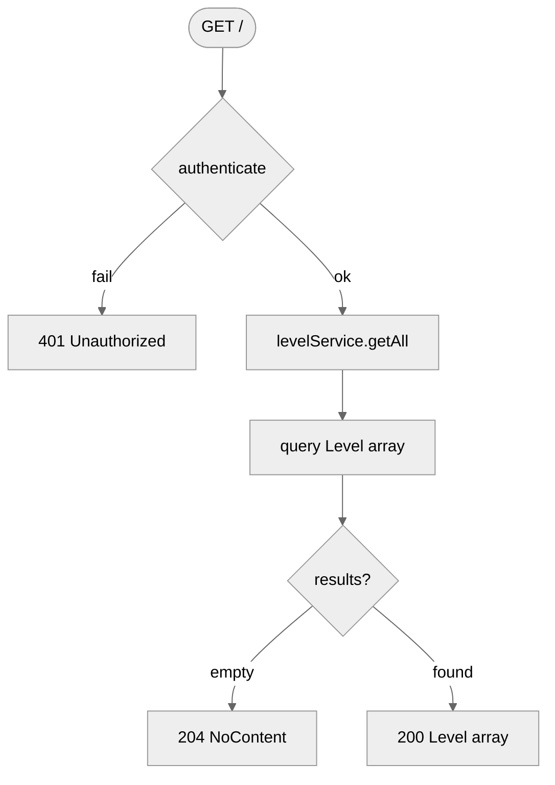
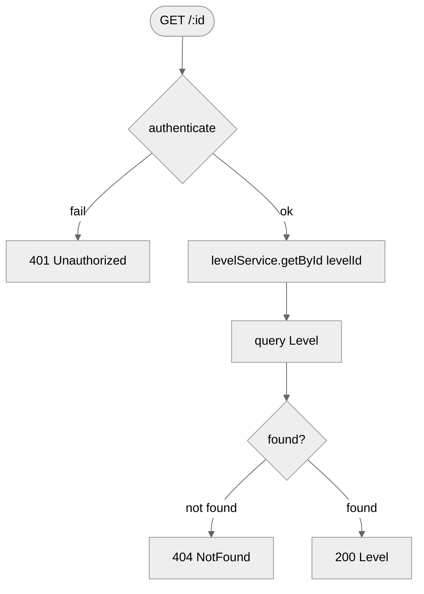
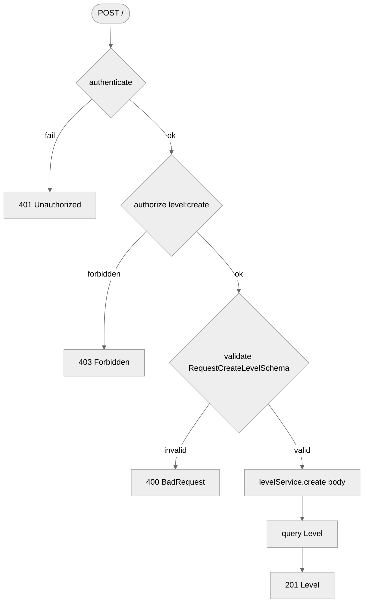
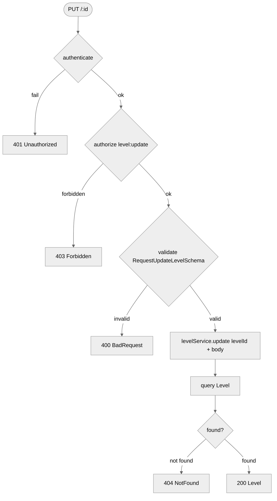
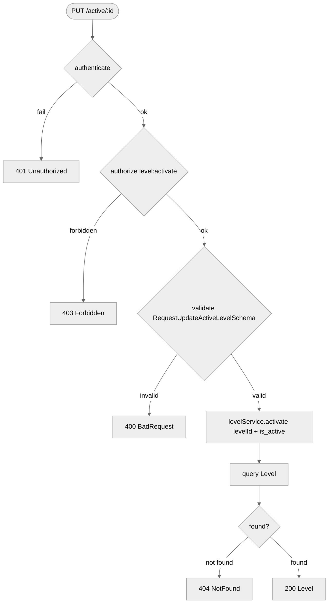
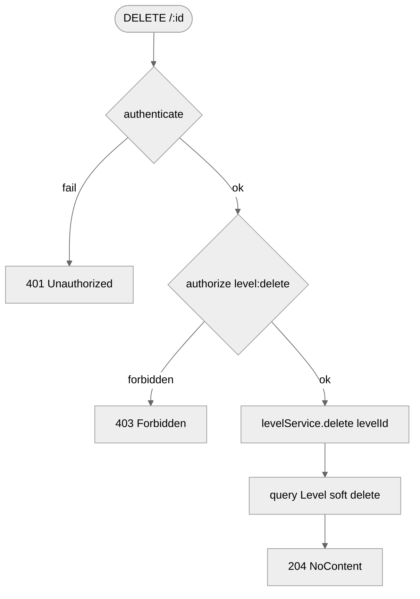

# Levels Route — Flowchart

## Endpoints
- `GET /` — get all active levels
- `GET /:id` — get specific level
- `POST /` — create level
- `PUT /:id` — update level
- `PUT /active/:id` — activate or deactivate level
- `DELETE /:id` — soft delete level

---

## GET /

## GET /:id

## POST /

## PUT /:id

## PUT /active/:id

## DELETE /:id

