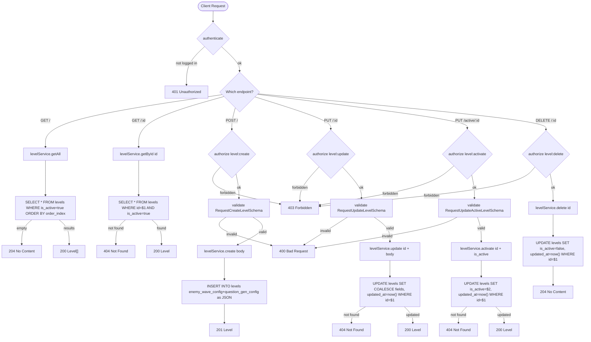

# Levels Route — Flowchart

All endpoints require `authenticate`. Some require `authorize(permission)`.

## Endpoints
- `GET /` — get all active levels
- `GET /:id` — get specific level
- `POST /` — create level
- `PUT /:id` — update level
- `PUT /active/:id` — activate or deactivate level
- `DELETE /:id` — soft delete level

