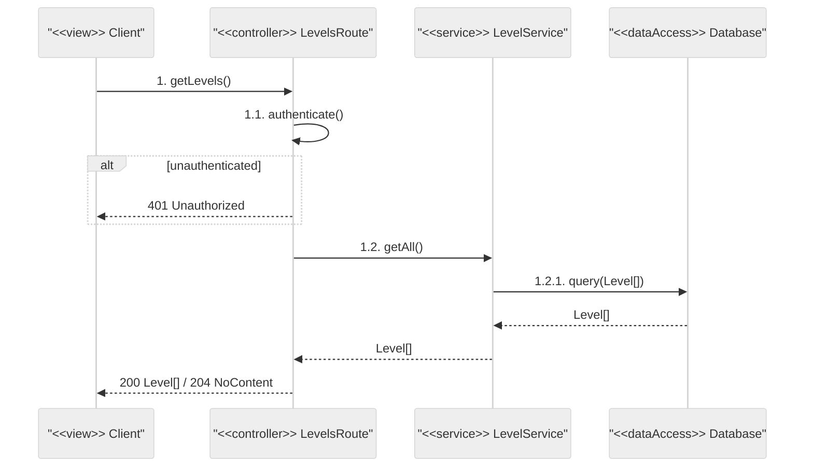
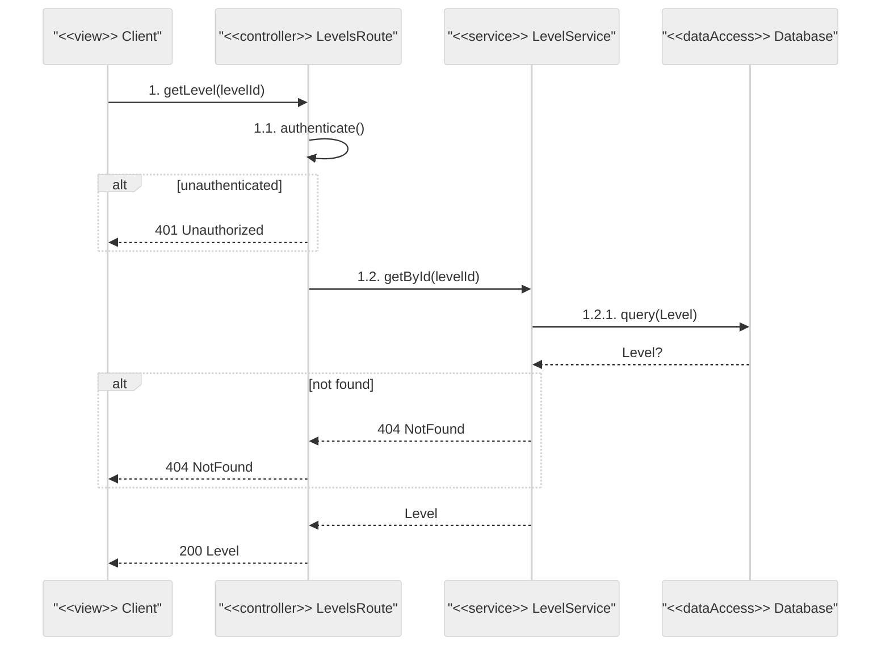
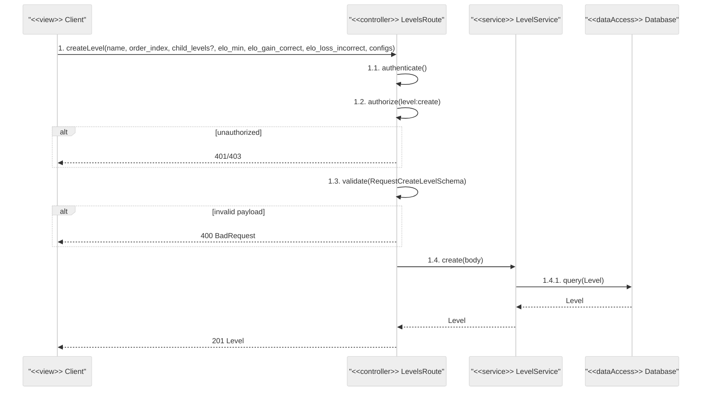
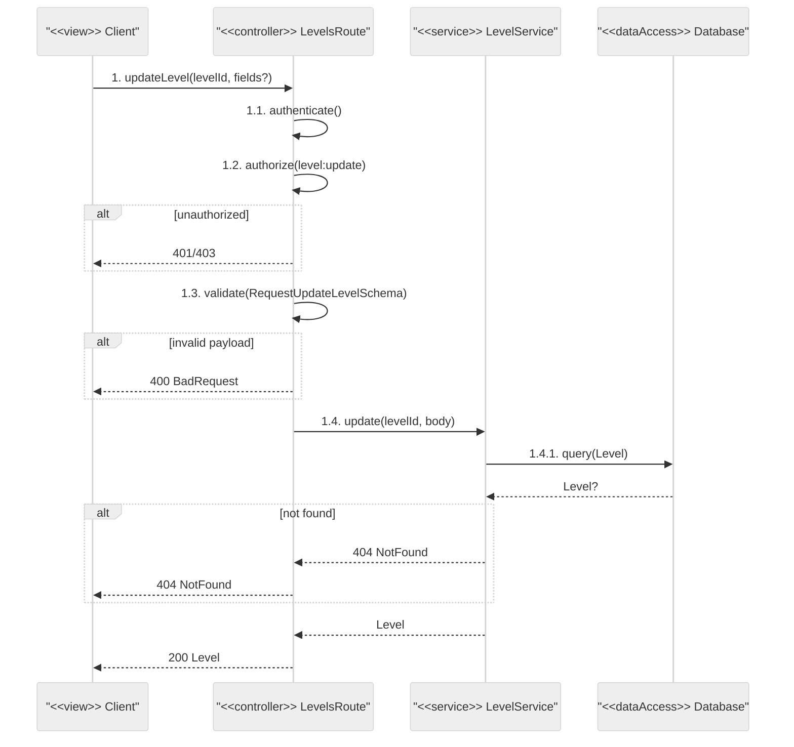
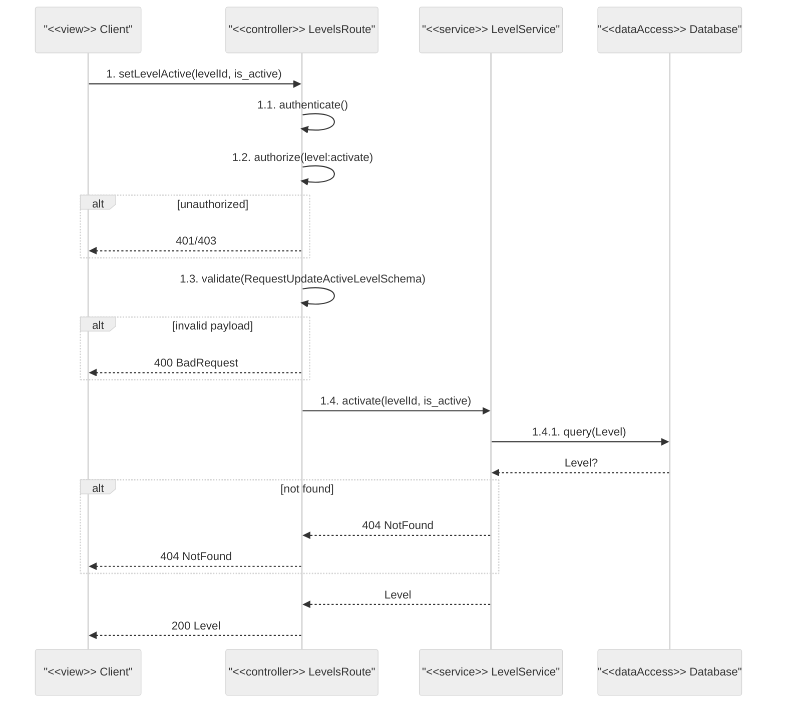
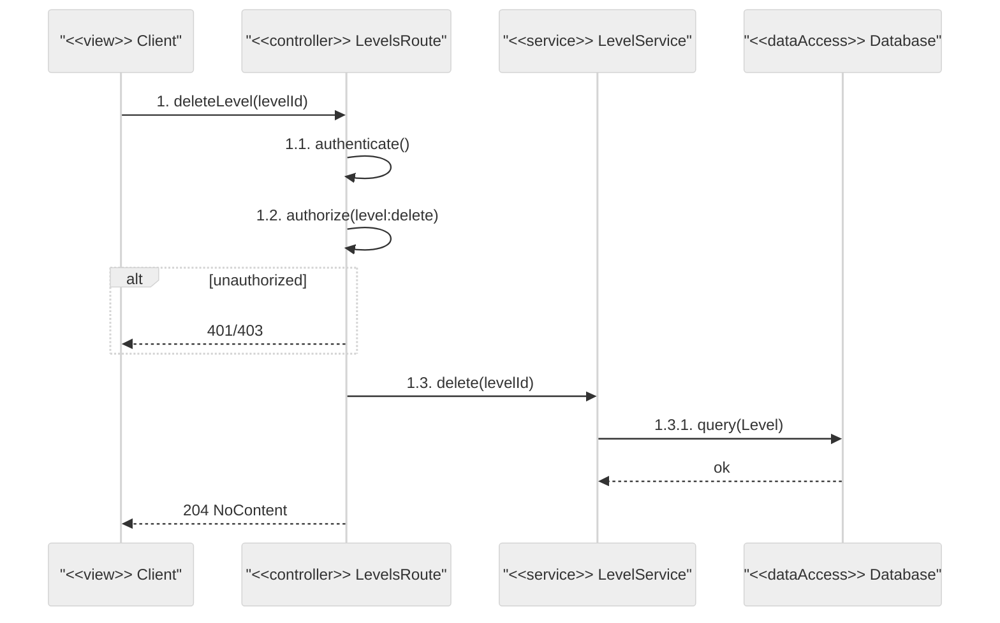
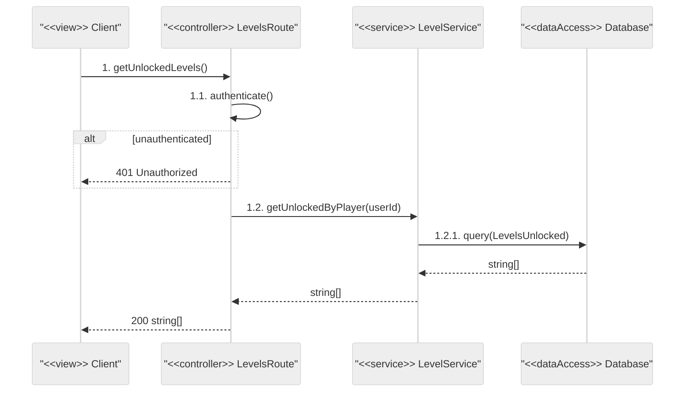

# Levels Route — Sequence Diagrams

## Endpoints
- `GET /` — get all active levels
- `GET /:id` — get specific level
- `POST /` — create level
- `PUT /:id` — update level
- `PUT /active/:id` — activate or deactivate level
- `DELETE /:id` — soft delete level
- `GET /unlocked` — get unlocked levels for player

---

## GET /

## GET /:id

## POST /

## PUT /:id

## PUT /active/:id

## DELETE /:id

## GET /unlocked

## Notes

- `getNextActive({afterId})` in `LevelService` is **not** called from this route — it is called internally by `GameService.end()` to determine the next unlockable level after session completion.
- Level ordering is by `order_index`, not by `id`. Progression follows `order_index ASC`.
