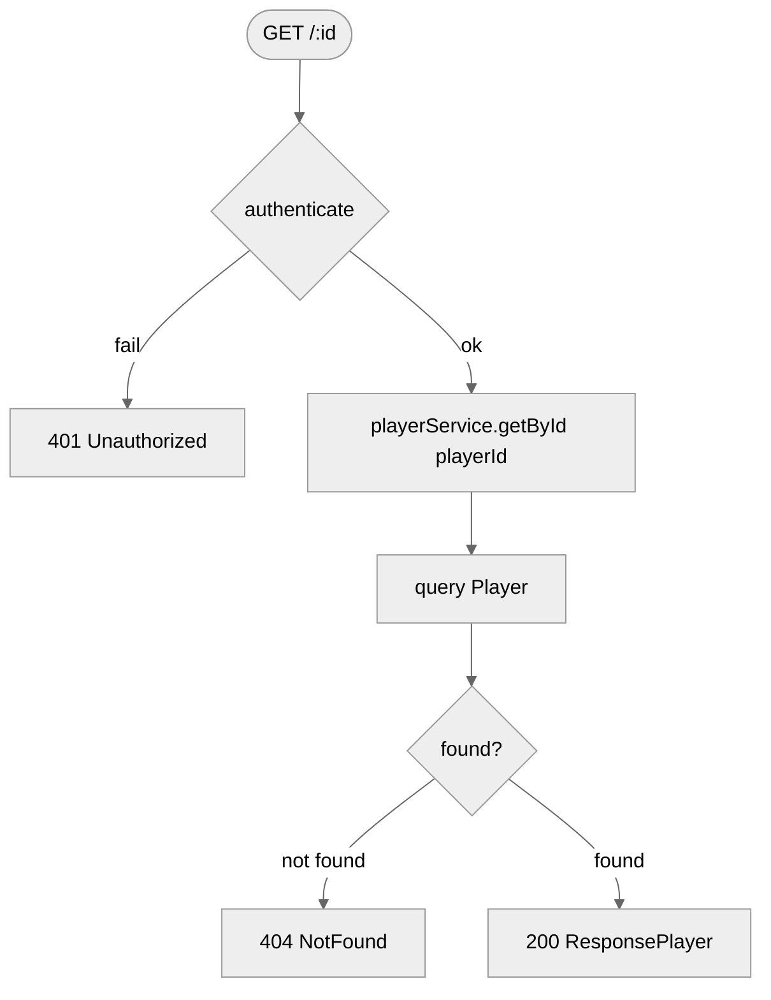
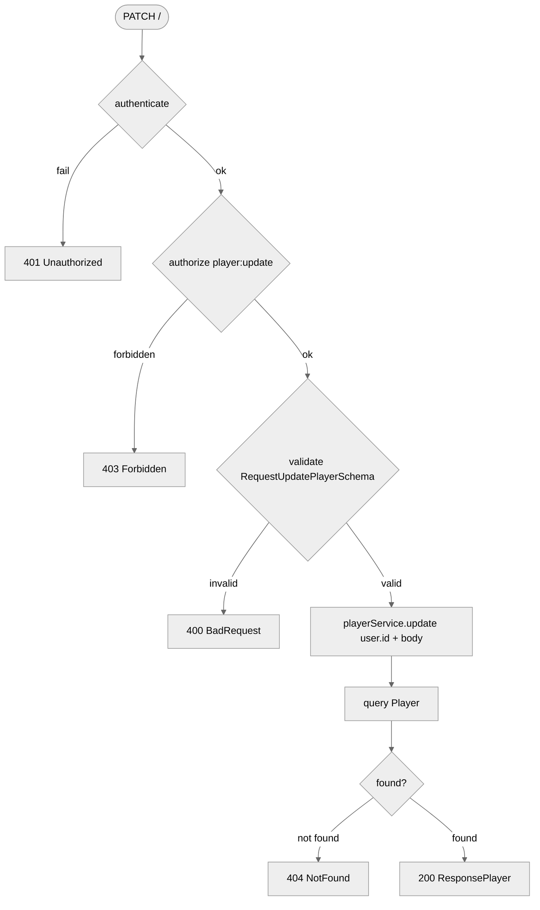
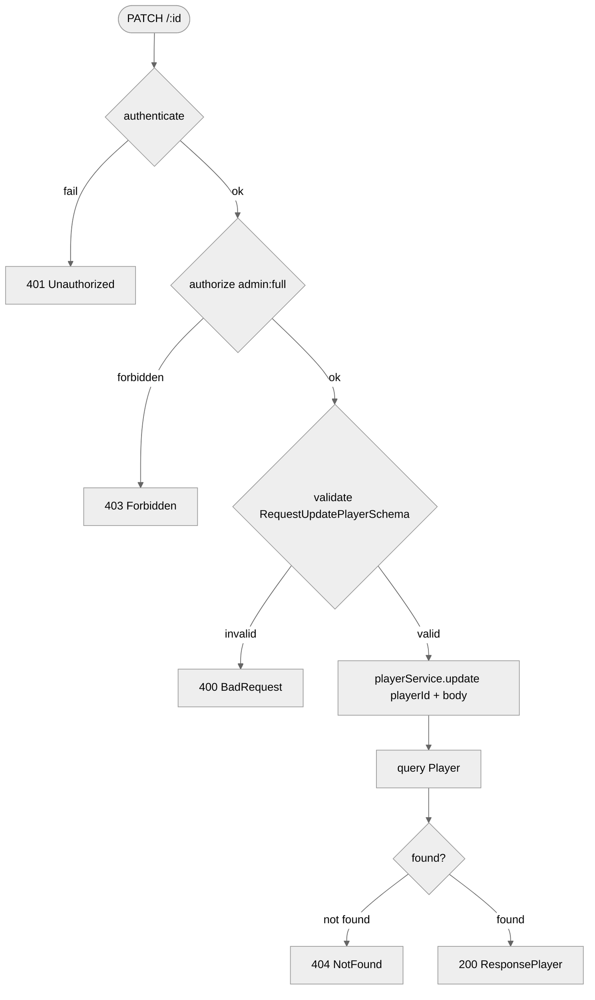

# Players Route — Flowchart

## Endpoints
- `GET /:id` — get any player profile
- `PATCH /` — update own profile
- `PATCH /:id` — update any player profile (admin only)

---

## GET /:id

## PATCH /

## PATCH /:id

