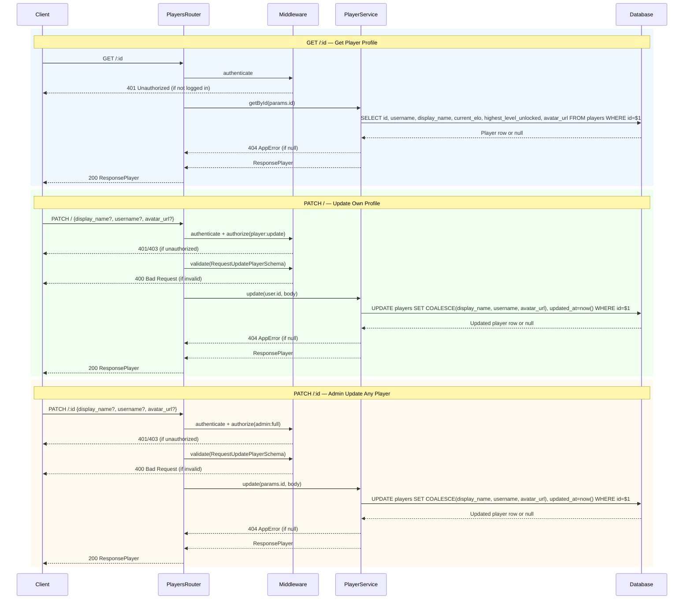

# Players Route — Sequence Diagrams

All endpoints require `authenticate`.

## Endpoints
- `GET /:id` — get any player profile
- `PATCH /` — update own profile
- `PATCH /:id` — update any player profile (admin only)

## Notes

- `updateAfterSession` in `PlayerService` is **not** called from this route — it is called internally by `GameService.end()` after a game session completes or fails.
- Both `PATCH /` and `PATCH /:id` share the same `PlayerService.update()` method; the difference is which player ID is passed (`user.id` vs `params.id`).
