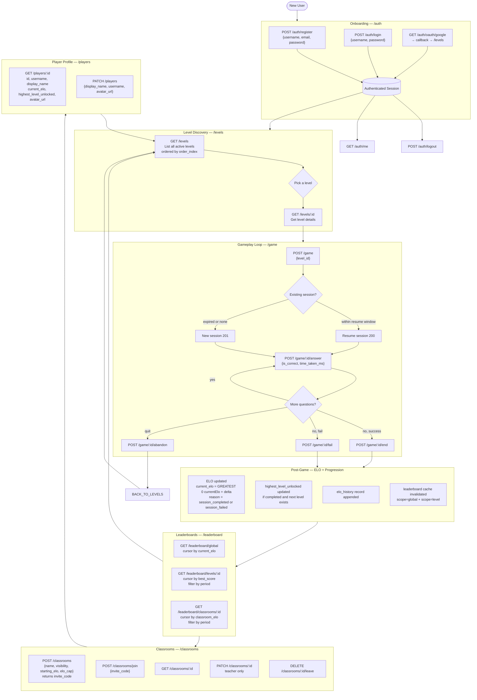
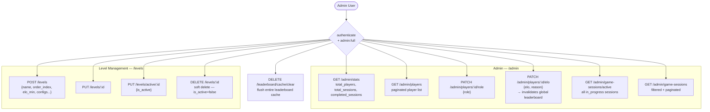
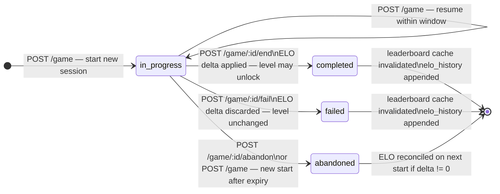
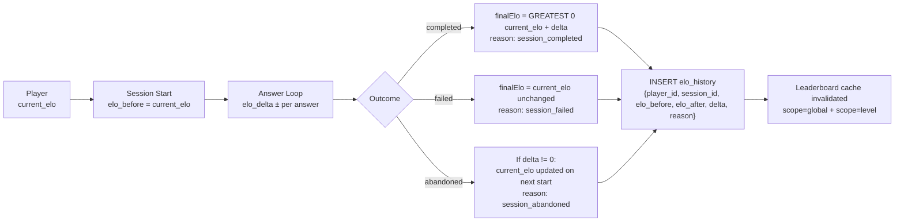

# Master User Flow — Magic Nugger API

Connects all API routes into end-to-end user journeys.

---

## 1. Complete Player Journey

---

## 2. Admin Journey

---

## 3. Session State Machine

---

## 4. ELO Flow

---

## 5. Logging Coverage Map

| Trigger | Event | Level |
|---|---|---|
| Register | *(none — implicit via session)* | — |
| Login (local) | `auth:login` | info |
| Login (OAuth) | `auth:oauth_login` | info |
| Logout | `auth:logout` | info |
| Unauthorized access | `auth:unauthorized` | warning |
| Session started | `session:started` | info |
| Session resumed | `session:resumed` | info |
| Session completed | `session:ended` | info |
| Session failed | `session:failed` | info |
| Session abandoned | `session:abandoned` | info |
| ELO updated (game) | `elo:updated` | info |
| ELO adjusted (admin) | `admin:elo_adjusted` + `elo:admin_adjusted` | info |
| Role changed (admin) | `admin:role_changed` | info |
| Players viewed (admin) | `admin:player_viewed` | info |
| Sessions viewed (admin) | `admin:sessions_viewed` | info |
| Cache hit | `cache:hit` | info |
| Cache miss | `cache:miss` | info |
| Cache cleared | `cache:pruned` | info |
| Schema validation fail | `error:schema-validation` | error |
| Client-side event | configurable `LogEvent` | configurable `LogLevel` |

All log events are written to `audit.log_events` (partitioned, indexed by event + created_at + user_id).
