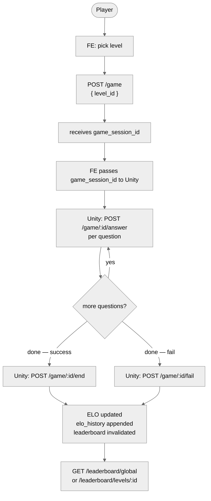
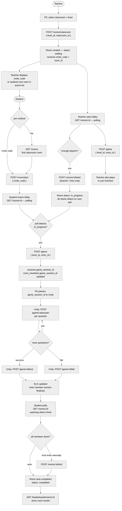
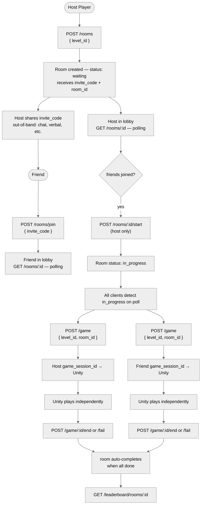
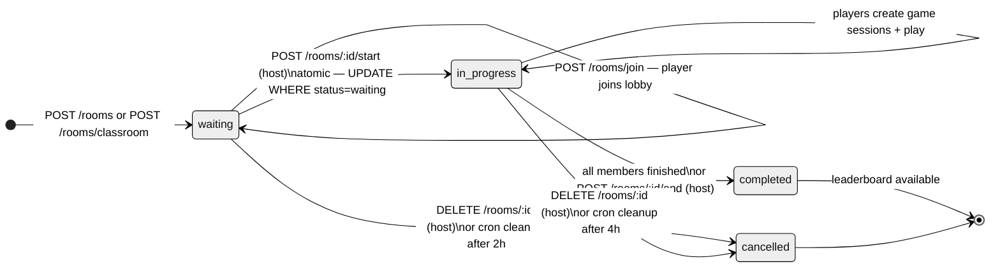
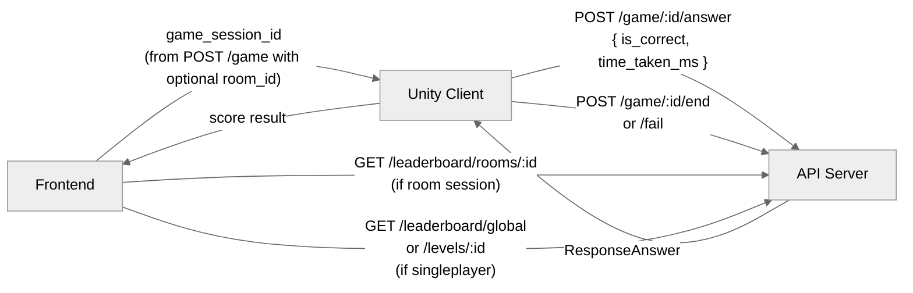
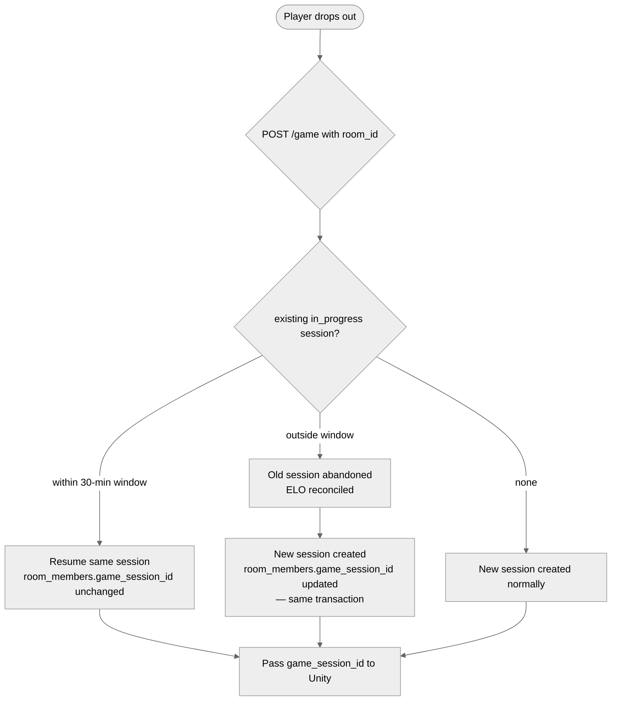

# Room-Based Multiplayer — User Flow

Unity integration note: Unity is always given a `game_session_id` by the frontend. It calls the same single-player game endpoints regardless of whether the session is part of a room or not. Room logic is invisible to Unity.

---

## 1. Singleplayer Flow (unchanged)

---

## 2. Classroom Game Flow

---

## 3. PVP Flow

---

## 4. Room State Machine

---

## 5. Unity Integration Summary

Unity only ever sees a single-player flow. Room membership is resolved entirely by the frontend before handing off to Unity.

**Unity never calls room endpoints. FE handles all room state.**

---

## 6. Abandoned Session Recovery in Room

